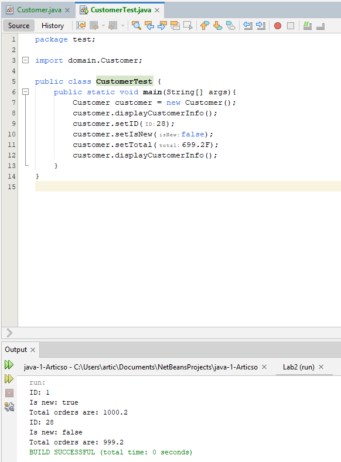

[](https://classroom.github.com/open-in-codespaces?assignment_repo_id=9863945)

**Код класу Customer:**
``` java
package domain;

public class Customer {
    private int ID;
    private boolean isNew;
    private float total;
    
    public Customer(){
        ID = 1;
        isNew = true;
        total = 1000.2F;
        
    }

    public void setID(int ID) {
        this.ID = ID;
    }

    public void setIsNew(boolean isNew) {
        this.isNew = isNew;
    }

    public void setTotal(float total) {
        this.total = total;
    }
    
    public void displayCustomerInfo(){
        System.out.println("ID: " + ID + "\nIs new: " + isNew + "\nTotal orders are: " + total);
    }
}
```
**Результат виконання коду:**


